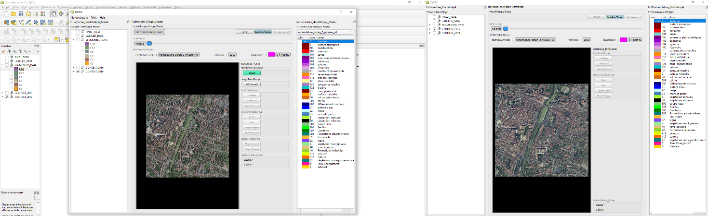
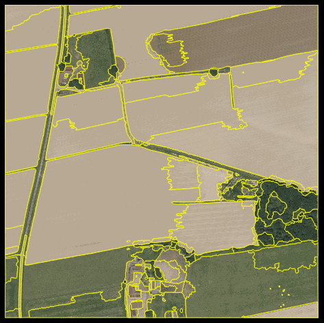

# TRAINMINATOR
OUtil de labellisation mono ou bi date pour la segmentation sémantique
et la détection du changement appliquée à la géomatique / télédétection.

## Qu'est-ce que c'est ?

TrainMinator est un outil de labellisation développé et maintenu en interne à l'IGN/DSI/(SDM et SIMV).
Il permet d'annoter de la segmentation sémantique mono ou bi-date (bi-date pour le changement).

Trainminator nécessite en entrée un projet QGis avec des contraintes spécifiques : images issues de
la BDOrtho IGN accompagné des MNS ainsi que d'une segmentation hiérarchique. 
Celle-ci est réalisé à l'aide de Pyram, qui sert à faire la segmentation multi-échelle, est ouvert (https://github.com/IGNF/pyram_legacy?tab=readme-ov-file).

Segmentation hierarchique:

## Ouverture avec l'extérieur

Le projet a été mis en licence ouverte GPL3.
Si vous êtes extérieur à l'IGN et vous souhaitez avoir plus d'informations que celles contenues dans la documentation
ou des précisions,
vous pouvez créer une issue.

Nous faisons de la maintenance pour nos besoins internes, et il n'est pas pour l'instant prévu de répondre à des demandes
de nouvelles fonctionnalités ni de maintenance externe, mais si vous voyez des bugs, nous vous serions reconnaissant de les signaler par une issue.

## Documentation Développeur(se)

Si vous souhaitez adapter le projet à vos besoins, une très brève documentation développeur est disponible dans le wiki: https://github.com/IGNF/trainminator/wiki.

Ou encore au format pdf ici:  [documentation utilisateur(trice)](Documentation_developpeur.pdf)

## Documentation Utilisateur(trice)
vous trouverez une documentation utilisateur ici: [documentation utilisateur(trice)](Documentation_utilisateur.pdf)

## Credits

TrainMinator a été développé en interne à l'[IGN/DSI/(SDM et SIMV)](https://www.ign.fr/) par Yann Le Borgne, Célestin Huet et Apolline De Wit. Ces dévelopements ont été aidés par Lucas Martelet, Maxime Dardy, Samy Khelifi, Pascal Voitot et Nicolas Gonthier. 

Lors de la réutilisation de cet outil, nous vous prions de bien vouloir citer l'IGN s'il vous plaît. 

